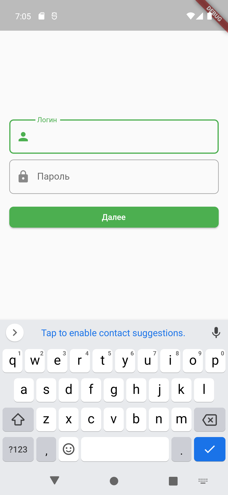
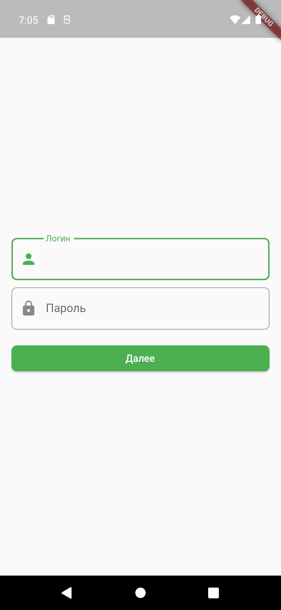
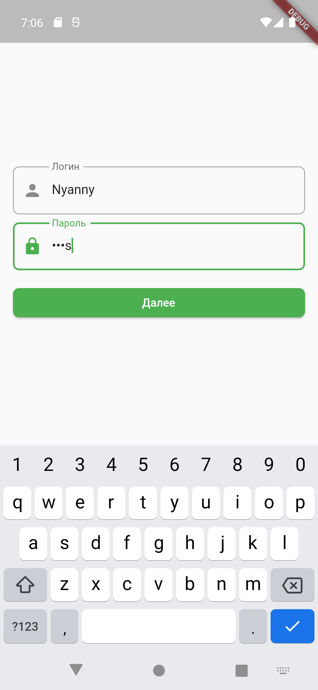
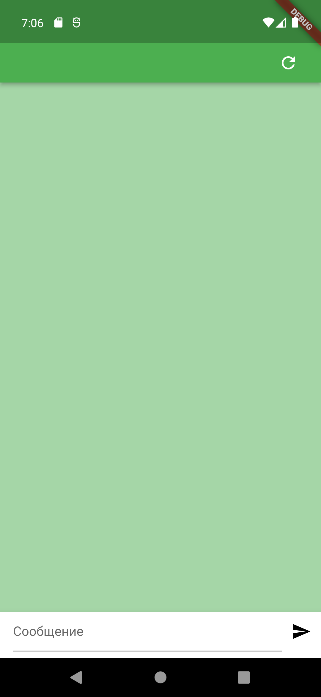
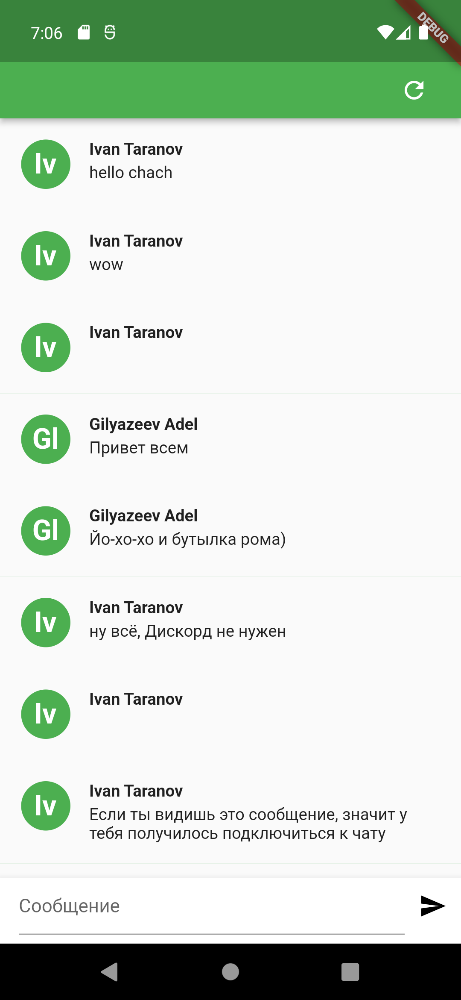

#Описание работы
Было сделано:
1. Все задания "Дня 1":
Для state management был взял Bloc:
   - Изменен класс MyApp - адапьтирован для Bloc(добавлены Provider'ы для Bloc и Repository)
   - Добавлен класс BlocNavigation, отвечающий за навигацию по статусам Bloc-авторизции
   - Bloc отвечает за авторизацию, имеется возможность расширения для валидации формы.
   - UI разбит на Экран + Виджеты, добавлен LoadingScreen состоящий из CircularProgressIndicator для случая, когда переход между экранами или загрузка начального экрана слишком долгие (в противном случае, он даже не успевает появиться)
   - Снекбар появляется, когда Bloc выдает ErrorState (SubmitButton построен через BlocConsumer)
   - Токен сохраняется в SharedPreferences в момент получения в фунции класса Bloc
   - Для работы с формой использовались TextEditingController, Bloc сохранял каждый введенный символ
1. Частично (сделана модель ChatMessageImageDto) сделано задание 5 из "Дня 2"

#Скриншоты

